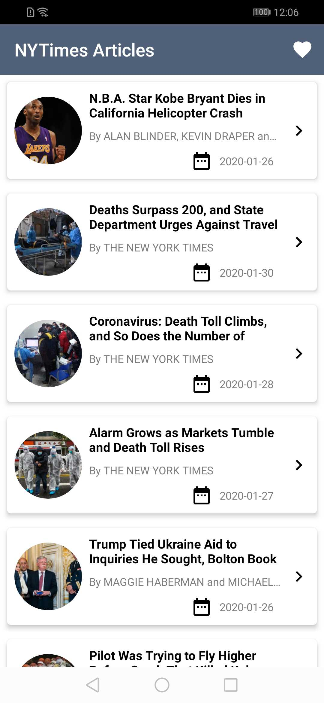
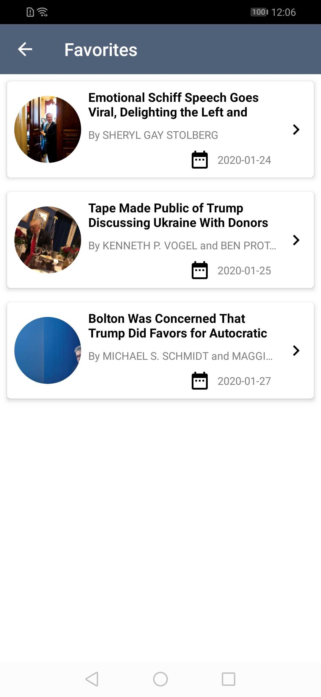
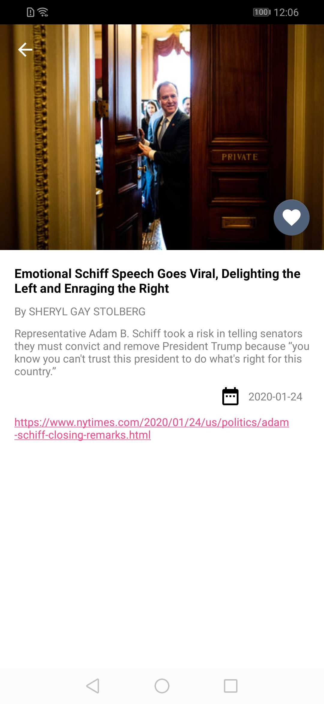

# NYTimesArticles

A simple app to hit the NY Times Most Popular Articles API and show a list of articles, that shows details when items on the list are tapped (a typical master/detail app), also user able to browse/ add articles to favorite list that implements MVVM architecture using Dagger2, Retrofit, Coroutines, LiveData, RoomDatabase, Database Debugging, DataBinding and Navigation Component.

 

    
    
    

 

## The app has following packages:
1. **data**: It contains all the data accessing and manipulating components.
2. **di**: Dependency providing classes using Dagger2.
3. **domain**: It contains dto classes and repositories.
4. **presentation**: View classes along with their corresponding Presenters.
5. **utils**: Utility classes.
#### Classes have been designed in such a way that it could be inherited and maximize the code reuse.
 
